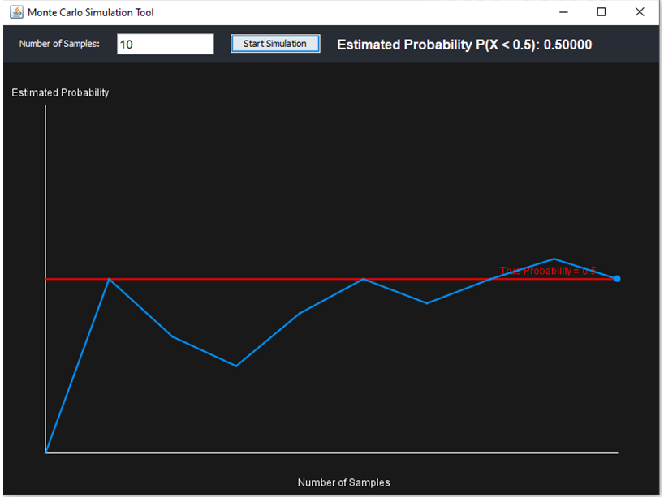
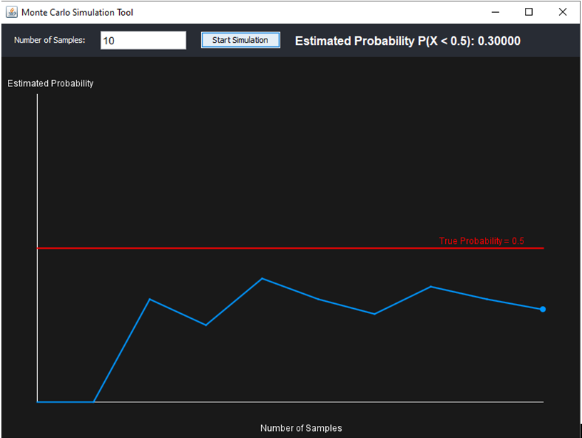
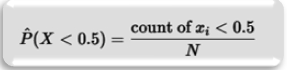

# Monte Carlo Simulation Tool

A modern Java GUI application for visualizing the convergence of Monte Carlo simulations.

## Overview

This application estimates the probability \( P(X < 0.5) \) using uniformly distributed samples in [0,1). It features real-time plotting, responsive controls, and professional UI styling using Java Swing.

## Execution

To run the file Click MonteCarloSimulation.jar

## Core Functionality

- Objective: Estimate (𝑋<0.5)P(X<0.5) by simulating a large number of samples.
- Visualization: Displays a real-time line chart showing convergence to the true probability value (0.5)

## GUI Preview

## Features

- Real-time Monte Carlo estimation
- Live convergence graph
- Java Swing GUI

## Usage

1. Enter number of samples (e.g., `1000`)
2. Click `Start Simulation`
3. View convergence graph and probability output

## Example Output

## Mathematical Implementations
Monte Carlo Method
This simulation uses the basic principle of Monte Carlo integration:
•	Generate 𝑁 N uniform random numbers 𝑥∈[0,1)x∈[0,1)
•	Count how many of them are less than 0.5
•	Estimate the probability as: 

## Authors
[n% I = w]
- Lee Ivan Sahurda  
- John Gilbert Balbuena  
- Emmanuelle Christian Obrero
